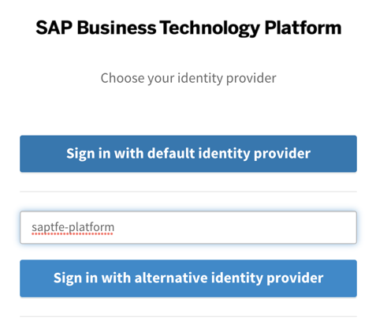
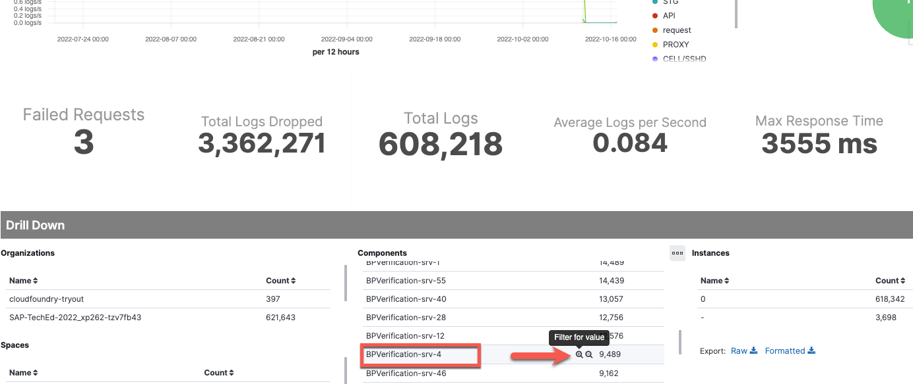
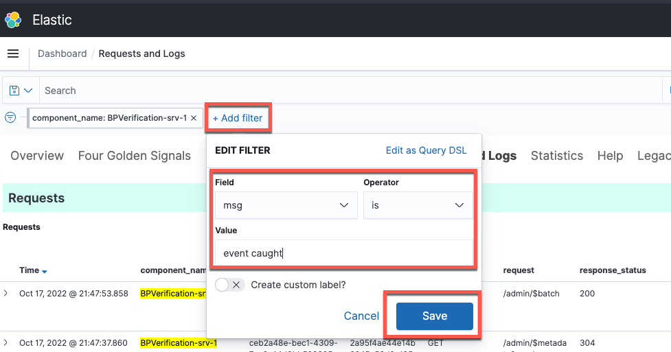
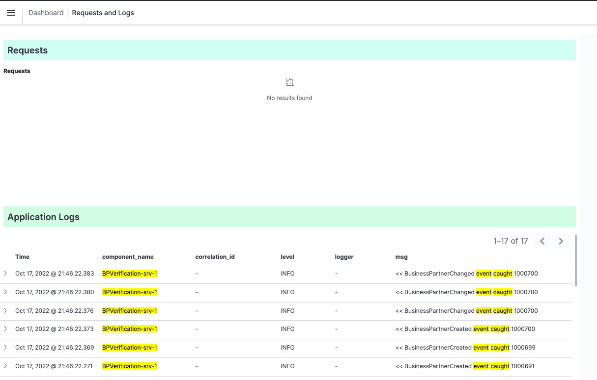
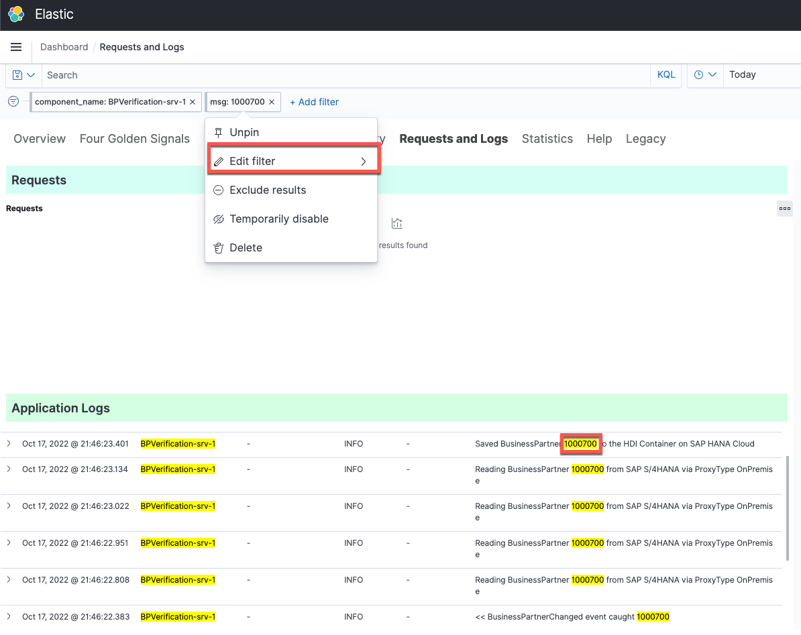

# Exercise 3 - Logging and Monitoring capabilities of SAP BTP with Application Logging service

Logging and monitoring are often overlooked when your application is operating correctly ... but what if that isn't the case?

The SAP Business Technology platform offers the Application Logging service to provide developers and administrators with not only CLI access to log output but also a Kibana dashboard for logging and monitoring purposes.

When something goes wrong with an application, developers usually use the Cloud Foundry CLI to directly analyze the log output. However, because the log data itself is complex and often JSON-based encapsulations of multiple values, it's not easy to filter or search. The SAP BTP Kibana dashboard offers numerous ways to gain insights into your SAP BTP based applications.

Logging and monitoring are crucial parts of cloud native architectures. Applications on the SAP BTP, Cloud Foundry runtime, such as yours in this session, are not exempt from this. As a result, we'd like to look at the Application Logging Service for SAP BTP, which allows us to use the pre-configured ELK stack (Elastic Search, Logstash, Kibana) with only one additional service binding. However, the Application Logging Service for SAP BTP is far from the only solution for logging and monitoring SAP BTP artifacts: see [DevOps with SAP BTP: Monitor & Operate](https://blogs.sap.com/2020/01/13/devops-with-sap-cloud-platform-monitor-operate/comment-page-1/#comment-634567) for some discussion on this.

## Exercise 3.1 Open the Kibana Dashboard via SAP BTP Cockpit

1. Firstly, navigate to the Kibana Dasbhoard using the SAP BTP Cockpit.

👉 Open the SAP BTP subaccount, select the **dev** space and navigate to your CAP application.

👉 Navigate to **Logs** in the side menu.

👉 **Open Kibana Dashboard**.

> The logs on this page are a good place to start because some of the log content that is output raw from the CF CLI, has been initially parsed into time, category, log type and the actual message (which is still presented here in raw format). You could already begin your exploratory searches, but that is not the focus of this exercise.

👉 In case you are asked for authentication, enter the following origin key (**saptfe-platform**) from the identity provider and sign in with alternative identity provider.

**Origin Key: saptfe-platform**

## Exercise 3.2 Get used to filters

The initial dasbhoard contains a lot of information that you might not be interested in. Actually, it contains information for all Cloud Foundry organizations and spaces in a single Cloud Foundry region to which you have been assigned. Since you're looking for your specific application, let's make sure you only get the relevant insights.

1. 👉 Bookmark this page as **Kibana dashboard**. You are going to use this page in the further exercises as well.

2. Filter for your particular _Component_, the CAP application. Because your user should only have access to one environment, there is no need to filter for _Organizations_ (Cloud Foundry organizations) and _Spaces_ (Cloud Foundry spaces).

👉 **Hover** over the line containing your application name, BPVerification-srv-\<STUDENT> and press the **+** icon to add this entry to your filter.

3. Adjust the time range in your filter criteria.

👉 **Change the date filter** to **Today**, so you can only see what happened today.

This filter will remain active throughout your browsing session but you can remove it at any time.

4. Let's first a look at the actual log output of your application before you can explore some monitoring visualisations and insights yourself.

👉 Navigate to the **Request and Logs** tab.

5. Let's try out a few different things with the logs. Let's see how many newly created Business Partners your application has processed today.

👉 Add a new filter by clicking **Add filter** next to the component name filter you just added. Choose **msg** as the field name, Operator **is** as the operator, and enter **event caught** as the field value.

This should give you a good idea, for example, when your application has been started and bulk-processed all the events in your SAP Event Mesh Queue. All of the events also contain business partners created by others in the SAP S/4HANA system.

👉 Change the **msg** filter you have just created and adjust the value entry to one of the business partners you have created. That way you can follow along how the operations (processing event, reading from SAP S/4HANA through SAP Cloud Connector, updating table in HDI Container on SAP HANA Cloud) have been made for a single business partner.

> Take some time to experiment with the filter choices and examine the logs. Filter for "enterprise-messaging-amqp" (field: msg), for example, to observe how CAP recognizes the need for new queues or subscriptions.

7. Fun task: Find out who is thoroughly reading the exercises and who is just rushing through. How? Simply remove the _component name_ filter to see when the business partner you're looking for was processed first and last. The application logs list will tell you the student number (as part of the component name in the list)

> Tip: Make your _msg_ filter more specific by filtering only for _BusinessPartnerCreated event captured BusinessPartnerID_.

8. If there is still time for this task, dedicate the remainder to exploring the other tabs in Kibana. These tabs give further information about Kibana's monitoring capabilities.

Kibana displays a set of pre-built dashboards that help you analyze your application, as follows:

- Use the **Overview dashboard (default)** to understand the evolution of logs and basic KPIs regarding failures, response time, and response size.
- Use the **Usage dashboard** to investigate the actual requests, their URLs, user, and component information.
- Use the **Performance and Quality** dashboard to investigate failures and response times.
- Use the **Network and Load** dashboard to investigate network traffic and payloads.
- Use the **Requests and Logs** dashboard to analyze the overall set of logs and requests as well as their involved components.
- Use the **Statistics dashboard** to see how many logs were shipped for each of your components as well as how many logs were dropped by the pipeline due to quota limitations.\* \* Use the **Metrics dashboard** to analyze CPU, memory, and disk usage of your applications.

## Summary

You've now hopefully gotten a more detailed understanding of how your application behaves and have a better overview, with concrete information, about when events have been consumed from the Queue or how CAP checks the need for SAP Event Mesh Queues/Subscriptions.

In the next exercise, we'll cover the data persistency for this application - the HDI Container on SAP HANA Cloud.

Continue to - [Exercise 4](../ex4/README.md)

---

Further Links:

- [What is SAP Application Logging Service? (help.sap.com)](https://help.sap.com/docs/APPLICATION_LOGGING/ee8e8a203e024bbb8c8c2d03fce527dc/3da50b904a314eed8c5daa671d12b647.html?locale=en-US)
- [DevOps with SAP BTP: Monitor & Operate (blogs.sap.com)](https://blogs.sap.com/tags/73554900100800002881/)
